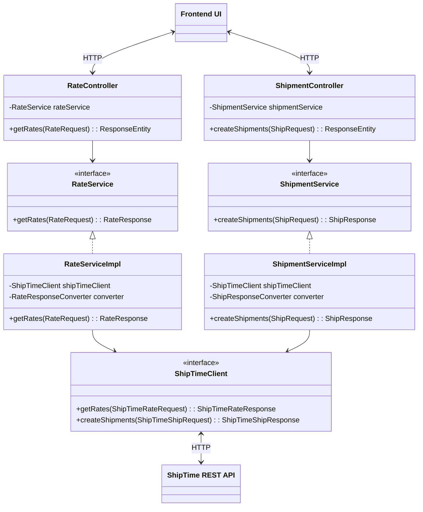
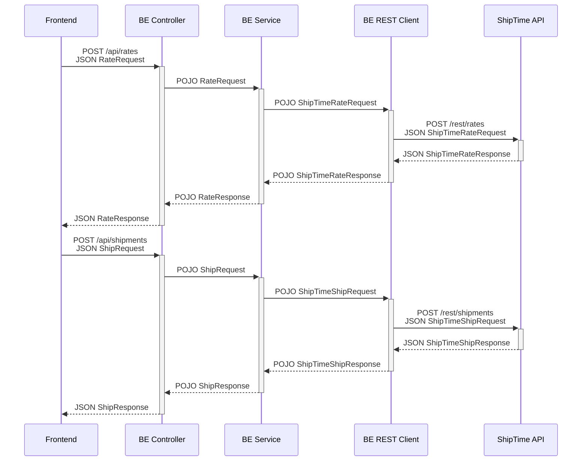

# Shipping Rate Comparison app

## Project Overview

The Shipping Rate Comparison app provides a simplified way to compare shipping rates from various carriers. By
integrating with the ShipTime Developer API, the app allows to input package dimensions, weight, and addresses
to retrieve and display a list of available carriers with corresponding shipping costs to select from. Once a carrier is
selected, the app will enable downloading the label PDF for the selected carrier.

## Functional Features

- Input package dimensions (length, width, height), weight, and addresses (origin and destination).
- Display shipping options from multiple carriers with corresponding shipping costs.

## Technical Features

- Handle API errors gracefully and provide user-friendly error messages.
- Cached responses (from the idempotent `POST /rates` endpoint) to reduce API calls and improve performance.
    - Caching settings can be configured as explained below (see configuration section).
- Lightweight contract mock server for ShipTime API generated based on ShipTime's Swagger documentation to facilitate
  development (see `src/test/resources/docker-compose.yml` for details)
- Externalized configuration (`application.yml` and `.env` files)
- **Two running modes**: 'devlocal' and 'sandbox'
    - 'devlocal' is meant **only for development and testing** while having the mock ShipTime API running locally.
    - 'sandbox' is meant for integrating with a live ShipTime API.
- Test suite for the Spring Boot API, including an end-to-end controller test hitting the `POST /rates` endpoint.
    - The integration test can be run either against the mock ShipTime API or the live ShipTime API using the profiles (
      see Running tests section below).
- Frontend implemented with vanilla JavaScript, HTML and CSS for a three-step
  shipping workflow, enabling to dynamically retrieve and select carriers for fetched shipping rates, and downloading
  shipment label. Shows errors in a simple alert window.
- Configurable logging (see `application.yml` for details).
  - By default, log files will be saved in the root directory of the project (will include truncated request and response payloads).

### Technologies Used

- **Programming Language**: Java 17
- **Framework**: Spring Boot (version 3.4.3)
- **Dependencies**:
    - Spring Boot
    - MapStruct
    - JUnit 5
    - Mockito
    - Maven
    - Docker with Docker Compose (to stand up a mock ShipTime API)
    - Caffeine (for caching)
- JavaScript ES6
- HTML 5
- CSS 3

### Architecture and design

3-tier (data-application-presentation layers) architecture. The application component follows the model-view-controller design:



Data flow sequence diagram:




## Configuration

The configurations can be updated in `application.yml` and environment variables can be set in the `.env` file:

 Property                             | Default Value          | Description                        | Notes                                                                       
--------------------------------------|------------------------|------------------------------------|-----------------------------------------------------------------------------
 spring.profiles.active               | ${SRC_PROFILE:sandbox} | Active Spring profile              | Defaults to "sandbox" if the `SRC_PROFILE` environment variable is not set. |
 server.port                          | ${SRC_PORT:9000}       | Port on which the application runs | Defaults to 9000 if the `SRC_PORT` environment variable is not set.         |
 client.logging.enabled               | true                   | Enable client logging              | Controls whether client logging is active.                                  |
 client.logging.include-headers       | false                  | Include HTTP headers in logs       | Set to true to log HTTP headers for client requests.                        |
 client.logging.truncate-logs         | true                   | Truncate long log messages         | If true, long log messages will be truncated for readability.               |
 cache.rates-endpoint.requests-cached | 100                    | Maximum number of cached requests  | Limits the number of requests cached for the rates endpoint.                |
 cache.rates-endpoint.expiry-minutes  | 10                     | Cache expiry time in minutes       | Specifies how long cached requests remain valid.                            |

### Environment Variables

The following can be defined in the `.env` file:

- `SHIPTIME_USERNAME`: ShipTime API username.
- `SHIPTIME_PASSWORD`: ShipTime API password.
- `SRC_PORT`: The port on which the application runs (optional).
- `SRC_PROFILE`: The Spring profile to be active (optional).

An `.env.example` file is provided as a template and should be renamed to `.env` and modified as needed.

## Running the app

### In 'sandbox' (the default) mode (sets the base-url to the sandbox ShipTime API and requires valid credentials in the `.env` file):

- Rename the `src/main/resources/.env.example` file to `src/main/resources/.env`, update the credentials, then run -

On Linux or macOS:

```shell
./mvnw spring-boot:run
```

On Windows:

```shell
mvnw.cmd spring-boot:run
```

### In 'devlocal' mode - only for development testing (sets the base-url to `http://localhost:8080` - the default mock ShipTime API URL):

- Rename the `src/main/resources/.env.example` file to `src/main/resources/.env`, **no credentials are required** in the
  `.env` file.
- Ensure you have Docker installed and running, then start the mock server by running the following from the repository
  root -

On Linux or Windows:

```shell
docker-compose -f src/test/resources/docker-compose.yml up -d
```

If the container started successfully, proceed to run the application with the following command -

On Linux or macOS:

```shell
./mvnw spring-boot:run -Dspring-boot.run.profiles=devlocal
```

On Windows:

```shell
mvnw.cmd spring-boot:run -Dspring-boot.run.profiles=devlocal
```

## Running tests

#### In 'sandbox' mode:

- Rename the `src/test/resources/.env.example` file to `src/test/resources/.env`, update the credentials.

- Running the following command will run the tests against the live sandbox ShipTime API -

On Linux or macOS:

```shell
./mvnw clean test
```

On Windows:

```shell
mvnw.cmd clean test
```

- Running the following command will only run unit tests (and will skip calling ShipTime API) -

On Linux or macOS:

```shell
./mvnw clean test -Dtest='!RateControllerIntegrationTest'  
```

On Windows:

```shell
mvnw.cmd clean test -Dtest='!RateControllerIntegrationTest'
```

#### In 'devlocal' mode:

- Rename the `src/test/resources/.env.example` file to `src/test/resources/.env`, **no credentials are required** in the
  `.env` file.
- Ensure you have Docker installed and running, then start the mock server by running the following from the repository
  root -

On Linux or Windows:

```shell
docker-compose -f src/test/resources/docker-compose.yml up -d
```

If the container started successfully, proceed to run the application with the following command -

On Linux or macOS:

```shell
./mvnw clean test -Dspring-boot.run.profiles=devlocal
```

On Windows:

```shell
mvnw.cmd clean test -Dspring-boot.run.profiles=devlocal
```